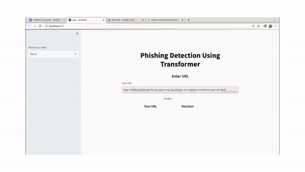

# Demo



# Presentation: Reading Assignment

- [X] [Attention is all you need: Paper](./reading_papers/1706.03762.pdf)
- [X] [Attention is all you need: Code](./notebooks/transformers/transformers.ipynb)

# Final Project : Implementation of algorithms to solve problem

- [X] [URLTran: Improving Phishing URL Detection Using
Transformers: paper](https://arxiv.org/pdf/2106.05256.pdf)
- [X] [URLTran: Improving Phishing URL Detection Using
Transformers: code](https://github.com/bfilar/URLTran)


# Data Sources

OpenPhish will provide 500 malicious URLs for free in TXT form. You can access that data [here](https://openphish.com/phishing_database.html).

Likewise, PhishTank is an excellent resource that provides a daily feed of malicious URLs in CSV or JSON format. You can gather ~5K through the following [link](https://www.phishtank.com/developer_info.php).


Finally, there is an excellent OpenSource project, [Phishing.Database](https://github.com/mitchellkrogza/Phishing.Database), run by Mitchell Krog. There is a ton of data available here to plus up your dataset.


https://www.kaggle.com/datasets/shashwatwork/web-page-phishing-detection-dataset


https://github.com/GregaVrbancic/Phishing-Dataset


https://data.mendeley.com/datasets/n96ncsr5g4


https://www.kaggle.com/datasets/taruntiwarihp/phishing-site-urls

https://data.mendeley.com/datasets/n96ncsr5g4

https://www.fcsit.unimas.my/phishing-dataset

https://research.aalto.fi/en/datasets/phishstorm-phishing-legitimate-url-dataset


# Run Project 

```bash

cd phishing-detection-transformer

cd src

pip3 install -r requirements.txt

streamlit run app.py

```


